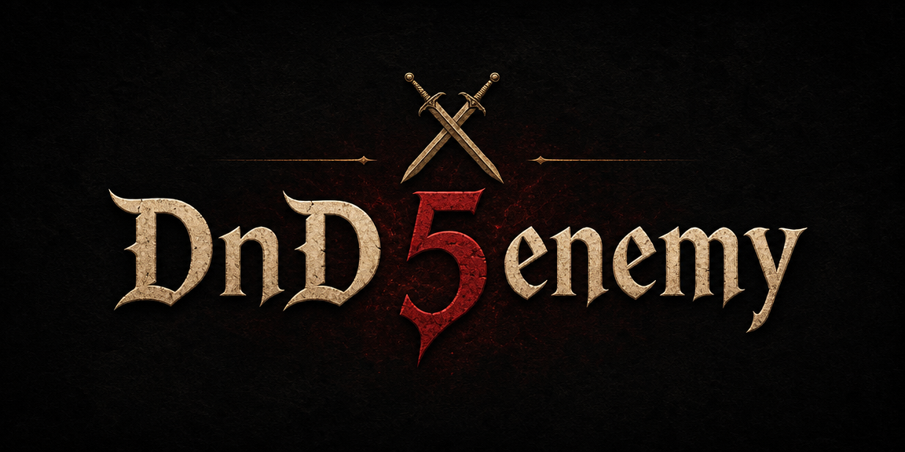

# DnD 5enemy



An AI-powered combat encounter generator for Dungeons & Dragons 5e Game Masters.

A GM types a natural-language description of an encounter — e.g. _"2 ice wolves and a frost troll on level 5 in a frozen cave"_ — and DnD 5enemy returns a complete set of enemy cards: multiple enemy types, balanced together as a unit, each with a full, D&D 5e-valid stat block. The differentiator is **encounter-level** generation (a group of enemies, balanced together), not monster-level generation one creature at a time.

## Features

- **Campaigns & battles** — organize encounters into campaigns; create, rename, and delete battles within them.
- **AI encounter generation** — describe an encounter in plain language and receive balanced D&D 5e enemy cards (name, level, stat block, abilities); confirm or deny each card individually before it's saved.
- **Enemy management** — edit a confirmed enemy's stats or remove it from a battle.
- **Battle environment** — generate atmospheric details for a battle (terrain, hazards, lighting, ambiance).
- **Main-enemy profile** — for a designated boss, generate a narrative description, tactics, and roleplay dialogue lines.
- **PDF export** — export a battle's enemy cards and environment as a printable, table-ready PDF (Unicode-safe, incl. Polish).
- **Internationalization** — full English and Polish UI, with AI-generated content following the active locale.
- **Authentication** — email/password auth with password reset, backed by Supabase.

## Tech Stack

- [Astro](https://astro.build/) v6 — server-first web framework (SSR), React islands
- [React](https://react.dev/) v19 — interactive UI components
- [TypeScript](https://www.typescriptlang.org/) v5 — type-safe JavaScript
- [Tailwind CSS](https://tailwindcss.com/) v4 + [shadcn/ui](https://ui.shadcn.com/) (new-york variant) — styling and UI primitives
- [Supabase](https://supabase.com/) — authentication and Postgres database
- [Anthropic Claude](https://www.anthropic.com/) (Claude Sonnet 4.6) via the [Vercel AI SDK](https://sdk.vercel.ai/) (`ai` + `@ai-sdk/anthropic`) — encounter generation
- [Paraglide JS](https://inlang.com/m/gerre34r/library-inlang-paraglideJs) — i18n (English + Polish)
- [pdf-lib](https://pdf-lib.js.org/) + [pdf-fontkit](https://www.npmjs.com/package/pdf-fontkit) — PDF export
- [Vitest](https://vitest.dev/) + [Playwright](https://playwright.dev/) — unit/integration and end-to-end testing
- [Cloudflare Workers](https://workers.cloudflare.com/) — edge deployment runtime

## Prerequisites

- Node.js v22.14.0 (as specified in `.nvmrc`)
- npm (comes with Node.js)
- [Docker](https://www.docker.com/) + ~7 GB RAM — only for the local Supabase stack
- An [Anthropic API key](https://console.anthropic.com/) — required for enemy generation

## Getting Started

1. Clone the repository:

```bash
git clone https://github.com/vroobel95/10x-DnD.git
cd 10x-DnD
```

2. Install dependencies:

```bash
npm install
```

3. Create your environment files from the template (see [Environment Variables](#environment-variables) and [Supabase Configuration](#supabase-configuration)):

```bash
cp .env.example .env
cp .env.example .dev.vars
```

`.env` is used by Astro and the Supabase CLI; `.dev.vars` supplies the same secrets to the local Cloudflare (`workerd`) dev runtime. Fill both with the same values.

4. Set up Supabase and apply database migrations — see [Supabase Configuration](#supabase-configuration) below.

5. Run the development server:

```bash
npm run dev
```

## Environment Variables

All secrets are declared via Astro's `astro:env` schema as **server-only** values — they are never exposed to the client. Set them in **both** `.env` and `.dev.vars`. Use `.env.example` as the template.

| Variable            | Required | Description                                                                                 |
| ------------------- | -------- | ------------------------------------------------------------------------------------------- |
| `SUPABASE_URL`      | yes      | Supabase project URL (local: `http://127.0.0.1:54321`, or the cloud project URL).           |
| `SUPABASE_KEY`      | yes      | Supabase `anon` public key (from the CLI output locally, or Dashboard → Settings → API).    |
| `ANTHROPIC_API_KEY` | yes      | Anthropic API key — powers all AI generation; the app errors at generation time without it. |

### End-to-end test variables

Playwright e2e tests read a separate `.env.e2e` file:

| Variable       | Description                                                    |
| -------------- | -------------------------------------------------------------- |
| `E2E_EMAIL`    | Email of a pre-existing test user for authenticated runs.      |
| `E2E_PASSWORD` | Password for the test user.                                    |
| `E2E_BASE_URL` | Base URL the tests run against (e.g. `http://localhost:4321`). |

## Supabase Configuration

This project uses Supabase for authentication **and** application data (campaigns, battles, enemies). The schema is managed through SQL migrations in [`supabase/migrations/`](supabase/migrations/); all tables have Row Level Security (RLS) enabled with per-operation, per-role policies.

### Option A — Local stack (no cloud project needed)

Requires [Docker](https://www.docker.com/) and ~7 GB RAM.

1. Create your `.env` file (if you haven't already):

```bash
cp .env.example .env
```

2. Initialize the local Supabase project (creates a `supabase/` config folder if missing):

```bash
npx supabase init
```

3. Start the local stack (downloads Docker images on first run):

```bash
npx supabase start
```

4. Copy the credentials printed by the CLI into your `.env` and `.dev.vars`:

```
SUPABASE_URL=http://127.0.0.1:54321
SUPABASE_KEY=<anon key from CLI output>
```

5. Apply the migrations to create the campaigns, battles, and enemies tables. `supabase start` already applies all migrations on first run; to apply any migrations added later, run:

```bash
npx supabase migration up
```

(To rebuild the local database from scratch against all migrations, use `npx supabase db reset`.)

6. To stop the stack when done:

```bash
npx supabase stop
```

The local Studio UI is available at `http://localhost:54323`.

### Option B — Cloud Supabase project

If you prefer a hosted Supabase project, set these in your `.env` and `.dev.vars`:

| Variable       | Description                                                |
| -------------- | ---------------------------------------------------------- |
| `SUPABASE_URL` | Project URL from Supabase Dashboard → Settings → API       |
| `SUPABASE_KEY` | `anon` public key from Supabase Dashboard → Settings → API |

```
SUPABASE_URL=https://<project-ref>.supabase.co
SUPABASE_KEY=<anon-key>
```

Then link the project and push the migrations:

```bash
npx supabase link --project-ref <project-ref>
npx supabase db push
```

### Email confirmation in local development

By default Supabase requires email confirmation before a user can sign in. To skip this during local development:

1. Open the Supabase dashboard for your project
2. Go to **Authentication → Email → Confirm email**
3. Toggle it **off**

Users can then sign in immediately after sign-up without clicking a confirmation link.

### Auth routes

| Route                   | Description                                                             |
| ----------------------- | ----------------------------------------------------------------------- |
| `/auth/signin`          | Email/password sign-in form                                             |
| `/auth/signup`          | Email/password sign-up form                                             |
| `/auth/confirm-email`   | Post-signup "check your inbox" page                                     |
| `/auth/forgot-password` | Request a password-reset email                                          |
| `/auth/reset-password`  | Set a new password from the reset link                                  |
| `/dashboard`            | Protected landing page (redirects to `/auth/signin` if unauthenticated) |

Route protection is handled in `src/middleware.ts`. Add paths to the `PROTECTED_ROUTES` array there to require authentication.

## Available Scripts

**Develop & build**

- `npm run dev` — Start the development server (Cloudflare `workerd` runtime)
- `npm run build` — Build for production
- `npm run preview` — Preview the production build
- `npm run astro` — Run the Astro CLI directly (e.g. `npm run astro -- add <integration>`)

**Quality**

- `npm run typecheck` — Type-check the project (`astro check`)
- `npm run lint` — Run ESLint with type-checked rules
- `npm run lint:fix` — Auto-fix ESLint issues
- `npm run format` — Run Prettier

**Test**

- `npm run test` — Run unit/integration tests once (Vitest)
- `npm run test:watch` — Run Vitest in watch mode
- `npm run test:coverage` — Run tests with coverage
- `npm run test:e2e` — Run Playwright end-to-end tests
- `npm run test:e2e:ui` — Run Playwright tests in UI mode
- `npm run e2e-test` — Open a headed Edge browser against the dev server for exploratory e2e work

## Internationalization

The app ships in **English and Polish** using [Paraglide JS](https://inlang.com/m/gerre34r/library-inlang-paraglideJs). Translation strings live in `messages/en.json` and `messages/pl.json` and are compiled into `src/paraglide/`. The active locale is stored in a cookie (`cookie` then `baseLocale` strategy) and can be switched from the navbar language toggle; AI-generated content (enemy names, environment descriptions, profiles) is produced in the active locale.

## Project Structure

```md
.
├── src/
│ ├── components/ # UI components (Astro & React); ui/ holds shadcn/ui primitives
│ ├── layouts/ # Astro layouts
│ ├── lib/ # Services & helpers (ai.ts, supabase.ts, pdf/, schemas/)
│ ├── pages/ # Astro pages
│ │ └── api/ # API endpoints
│ ├── paraglide/ # Generated Paraglide i18n runtime
│ ├── styles/ # Global styles
│ ├── middleware.ts # Auth route-guard middleware
│ └── types.ts # Shared entity & DTO types
├── messages/ # Paraglide translation sources (en.json, pl.json)
├── supabase/
│ └── migrations/ # SQL migrations (RLS-enabled schema)
├── tests/ # Vitest (unit/integration) + Playwright (e2e)
├── public/ # Public assets
└── wrangler.jsonc # Cloudflare Workers config
```

## Git Hooks

A [lefthook](https://lefthook.dev/) pre-commit hook runs on every commit (configured in `lefthook.yml`):

- **lint** — ESLint `--fix` on staged `*.{ts,tsx,js,jsx}` files
- **typecheck** — `tsc --noEmit`
- **test** — `vitest related` on staged `*.{ts,tsx}` files

Set `LEFTHOOK=0` to skip the hook for a single commit.

## Deployment

This project deploys to [Cloudflare Workers](https://workers.cloudflare.com/) (worker name `dnd-5enemy`). The configuration in `wrangler.jsonc` includes a KV namespace bound as `SESSION`, which must exist in your Cloudflare account.

1. Build the project:

```bash
npm run build
```

2. Deploy with Wrangler:

```bash
npx wrangler deploy
```

3. Set the required secrets in your Cloudflare dashboard or via the CLI:

```bash
npx wrangler secret put SUPABASE_URL
npx wrangler secret put SUPABASE_KEY
npx wrangler secret put ANTHROPIC_API_KEY
```

## CI

GitHub Actions runs on every push and pull request to `main`: lint → typecheck → test → build. On push to `main`, a deploy job publishes to Cloudflare Workers. Configure these repository secrets: `SUPABASE_URL` and `SUPABASE_KEY` (used by the build), plus `CLOUDFLARE_API_TOKEN` and `CLOUDFLARE_ACCOUNT_ID` (used by the deploy job).

## License

MIT
